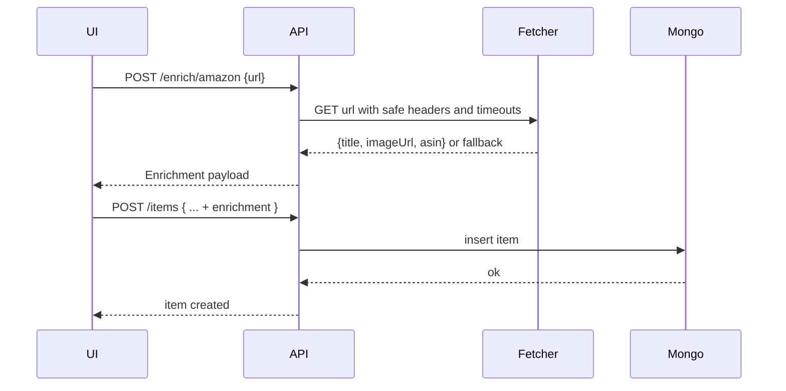
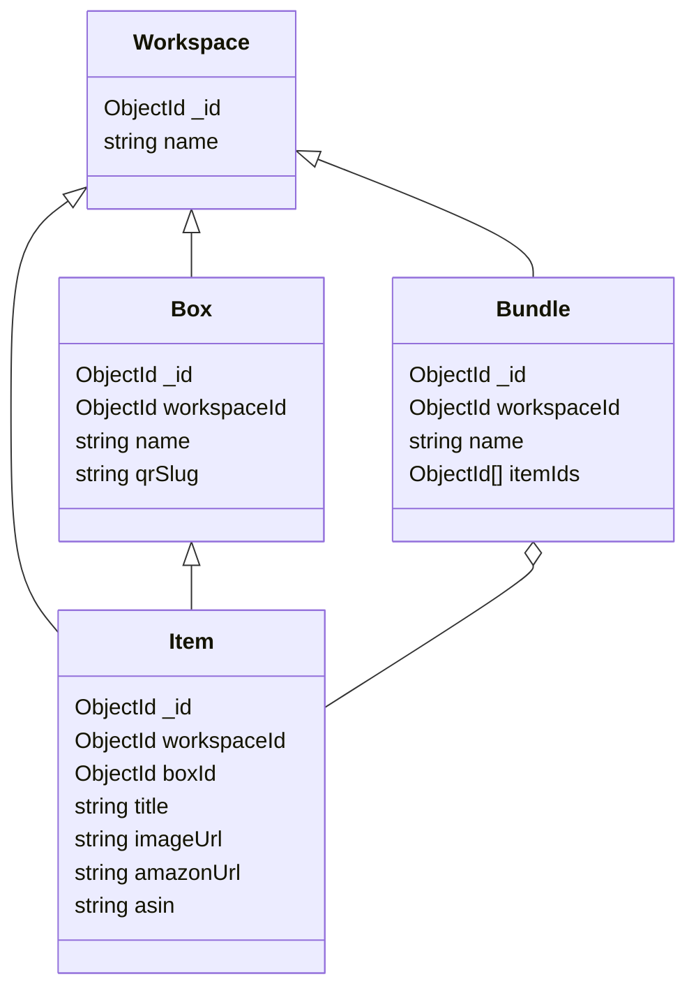

# PRD: College Package Inventory App

---

## 1) Summary

A web app to track everything a student is packing for college. Users create boxes or bundles, add items to them, and attach an Amazon URL to auto-pull title and image for quick visual confirmation. Data lives in MongoDB. A backend service exposes a clean REST API to the frontend for create, read, update, and delete.

Preferred languages: **Python** or **Go**.

---

## 2) Goals and Non-Goals

### Goals

- Make it fast and simple to log what is in each box or bundle.
- Let users paste an Amazon URL to enrich an item with title and image.
- Generate a QR code for each box for quick lookups during move-in.
- Support multiple households or families under one account group.
- Be mobile friendly.

### Non-Goals (for V1)

- No marketplace or selling.
- No deep Amazon price tracking.
- No barcode scanner hardware integration.
- No offline sync.

---

## 3) Target Users and Personas

- **Student**: needs to know what is packed, where it is, and if it made it to the dorm.
- **Parent or Organizer**: creates boxes, adds items, prints QR labels, checks everything off on move-in day.
- **Roommate or Helper**: read-only scan via QR to see contents.

---

## 4) Key Use Cases and User Stories

1. **Create box**  
   As a parent, I can create a box with a name, location, status, and QR code.  
2. **Add item with Amazon URL**  
   As a user, I can paste an Amazon URL and the app fetches title and image; I can edit details before saving.  
3. **Bundle grouping**  
   As a user, I can create a named bundle like “Kitchen Essentials” and add items across multiple boxes.  
4. **Search and filter**  
   As a user, I can filter by room, category, box, status, or destination.  
5. **Checklist on arrival**  
   As a user, I scan a box QR and tap items to confirm arrival.  
6. **Share**  
   As a user, I can invite a helper to view or update a specific box or bundle.  
7. **Export**  
   As a user, I can export boxes and items to CSV for backup or printing.

---

## 5) Scope for V1 (MVP)

- Auth with email plus magic link or password. Simple roles: owner, editor, viewer.
- Create, update, archive for boxes and bundles.
- Add items. Optional image via Amazon URL or manual upload.
- QR code generation per box.
- Search and filters.
- CSV export.
- Basic activity log per box.

---

## 6) Success Metrics

- Time to create a box and add first item under 30 seconds.
- At least 80 percent of items added with image enrichment from Amazon.
- Zero app-level data loss incidents.
- 95th percentile API response under 300 ms for reads at MVP scale.

---

## 7) Functional Requirements

### 7.1 Boxes

- Fields: name, description, tags, source location, destination, status (planned, packed, shipped, arrived), QR code id, created by, updated at.
- Actions: create, update, archive, generate QR code, list, get by id.

### 7.2 Items

- Fields: title, description, quantity, category, estimated value, image URL, Amazon URL, ASIN (if parsed), box id, bundle ids[], status (planned, packed, arrived), notes.
- Actions: create, update, move to another box, attach to bundles, delete.

### 7.3 Bundles

- Fields: name, description, tags, item ids[], owner id.
- Actions: create, update, add or remove items, delete.

### 7.4 Enrichment

- When an Amazon URL is pasted:
  - Try Open Graph tags to grab title and image.
  - Attempt ASIN extraction from URL patterns.
  - Optional future: Amazon Product Advertising API for robust data when keys are provided.
  - Fallback if fetch fails: keep the raw URL and let the user edit.

### 7.5 QR Codes

- Each box gets a unique slug used to render a public or restricted view.
- Scanning leads to a read-optimized page with contents and quick status toggles if the user is signed in with edit rights.

### 7.6 Sharing and Roles

- Invite via email to a workspace with role: owner, editor, viewer.
- Box-level share link toggle for read-only if needed.

### 7.7 Export

- CSV export for boxes, items, and bundles.

---

## 8) Non-Functional Requirements

- **Performance**: p95 read under 300 ms at 10k items and 500 boxes per workspace.
- **Security**: JWT sessions, HTTPS only, server-side input validation, rate limits on enrichment calls.
- **Privacy**: No third-party tracking beyond optional Amazon API calls.
- **Reliability**: At least 99.5 percent uptime target for MVP.
- **Scalability**: Horizontal scale of stateless API and frontend. MongoDB with proper indexes.
- **Observability**: Structured logs, request ids, basic metrics (RPS, latency, error rate), error tracing.

---

## 9) Data Model (MongoDB)

### Collections

#### users

```json
{
  "_id": "ObjectId",
  "email": "string",
  "name": "string",
  "roles": ["owner" | "editor" | "viewer"],
  "workspaces": ["ObjectId"], 
  "createdAt": "Date",
  "updatedAt": "Date"
}
```

#### workspaces

```json
{
  "_id": "ObjectId",
  "name": "string",
  "ownerId": "ObjectId",
  "members": [
    {"userId": "ObjectId", "role": "owner|editor|viewer"}
  ],
  "createdAt": "Date",
  "updatedAt": "Date"
}
```

#### boxes

```json
{
  "_id": "ObjectId",
  "workspaceId": "ObjectId",
  "name": "string",
  "description": "string",
  "tags": ["string"],
  "sourceLocation": "string",
  "destination": "string",
  "status": "planned|packed|shipped|arrived",
  "qrSlug": "string", 
  "createdBy": "ObjectId",
  "createdAt": "Date",
  "updatedAt": "Date"
}
```

#### items

```json
{
  "_id": "ObjectId",
  "workspaceId": "ObjectId",
  "boxId": "ObjectId",
  "bundleIds": ["ObjectId"],
  "title": "string",
  "description": "string",
  "quantity": "number",
  "category": "string",
  "estimatedValue": "number",
  "imageUrl": "string",
  "amazonUrl": "string",
  "asin": "string",
  "status": "planned|packed|arrived",
  "notes": "string",
  "createdAt": "Date",
  "updatedAt": "Date"
}
```

#### bundles

```json
{
  "_id": "ObjectId",
  "workspaceId": "ObjectId",
  "name": "string",
  "description": "string",
  "tags": ["string"],
  "itemCount": "number",
  "createdBy": "ObjectId",
  "createdAt": "Date",
  "updatedAt": "Date"
}
```

#### activity_logs

```json
{
  "_id": "ObjectId",
  "workspaceId": "ObjectId",
  "actorId": "ObjectId",
  "entityType": "box|item|bundle",
  "entityId": "ObjectId",
  "action": "create|update|move|archive|status_change|share",
  "metadata": "object",
  "createdAt": "Date"
}
```

### Indexes

- `boxes`: workspaceId, status, qrSlug unique.
- `items`: workspaceId, boxId, bundleIds, title text, category, status.
- `bundles`: workspaceId, name.

---

## 10) API Design (REST)

**Base path**: `/api/v1`

### Auth

- POST `/auth/register`
- POST `/auth/login`
- POST `/auth/magic-link` (optional)

### Workspaces

- GET `/workspaces`
- POST `/workspaces`
- POST `/workspaces/:id/invite`
- PATCH `/workspaces/:id/members`

### Boxes

- GET `/workspaces/:wsId/boxes`
- POST `/workspaces/:wsId/boxes`
- GET `/workspaces/:wsId/boxes/:boxId`
- PATCH `/workspaces/:wsId/boxes/:boxId`
- DELETE `/workspaces/:wsId/boxes/:boxId` (soft archive)
- GET `/boxes/qr/:slug` public or gated view

### Items

- GET `/workspaces/:wsId/items?boxId=&bundleId=&q=&status=`
- POST `/workspaces/:wsId/items`
- GET `/workspaces/:wsId/items/:itemId`
- PATCH `/workspaces/:wsId/items/:itemId`
- PATCH `/workspaces/:wsId/items/:itemId/move` body: `{ boxId }`
- DELETE `/workspaces/:wsId/items/:itemId`

### Bundles

- GET `/workspaces/:wsId/bundles`
- POST `/workspaces/:wsId/bundles`
- GET `/workspaces/:wsId/bundles/:bundleId`
- PATCH `/workspaces/:wsId/bundles/:bundleId`
- DELETE `/workspaces/:wsId/bundles/:bundleId`

### Enrichment

- POST `/enrich/amazon` body: `{ url }`  
  Returns `{ title, imageUrl, asin }`

### Export

- GET `/workspaces/:wsId/export.csv?scope=items|boxes|bundles`

**Error format**

```json
{ "error": { "code": "string", "message": "string" } }
```

---

## 11) UX Notes

- Create Box flow on first login with inline tips.
- Paste Amazon URL auto-fetches title and image with a loading state and edit fields.
- QR code button on the box detail. Provide “Print Label” that renders QR plus box name.
- Mobile friendly list and detail views. Sticky search and filters.

---

## 12) Architecture Overview

### Suggested stack

- **Frontend**: React with Next.js or Remix, TypeScript, Tailwind.
- **Backend (choose one)**  
  - Python: FastAPI, Pydantic, Uvicorn, HTTPX for enrichment fetch, PyMongo or Motor.  
  - Go: Gin or Fiber, go-playground validator, http.Client with timeouts, official MongoDB Go driver.  
- **Database**: MongoDB Atlas.
- **Auth**: JWT access tokens, short TTL with refresh token rotation.
- **Storage**: User uploads to S3 or Cloud Storage if we support manual images.
- **Infra**: Docker, Terraform for IaC, GitHub Actions for CI, Fly.io or Render or AWS ECS Fargate for hosting.

### High level sequence (Amazon URL enrichment)



### Data relationships (simplified)



---

## 13) Security and Compliance

- All inputs validated server side.
- Rate limit enrichment to prevent abuse.
- Content Security Policy on frontend.
- Do not store Amazon cookies. Fetch with a neutral user agent.
- Optional: enable parental controls for sharing.
- Backups for MongoDB with daily snapshots and 7 to 14 day retention.

---

## 14) Performance and Capacity

- Pagination on all list endpoints, default page size 25, cap at 100.
- Caching layer for enrichment responses by URL or ASIN for 24 hours.
- Background job for image proxying and thumbnail generation.

---

## 15) Observability

- Structured JSON logs with request id and user id.
- Metrics: RPS, latency, error rate, enrichment success rate, Mongo query time.
- Alerts on API 5xx and elevated latency.

---

## 16) Rollout Plan

1. Design spike: confirm schema and flows with clickable wireframes.
2. MVP: auth, boxes, items, basic enrichment, QR codes, CSV export.
3. Beta: bundles, sharing, activity logs, thumbnails, better search.
4. GA: role model hardening, label printing templates, polish.

---

## 17) Risks and Mitigations

- Amazon markup changes break OG scraping. Mitigation: graceful fallback and optional Product Advertising API.
- URL abuse. Mitigation: validate hostname, denylist, head-request first, size limits, timeouts.
- QR link leakage. Mitigation: signed short-lived links or require login unless box is explicitly shared.

---

## 18) Open Questions

- Do we want SSO or just email and password for V1.
- Should QR views be public read-only by default or private by default.
- Do we need per-item photos beyond Amazon images for custom items.

---

## 19) Acceptance Criteria (MVP)

- User can create a workspace, a box, and add at least one item with Amazon URL enrichment.
- Box detail page shows QR code and item list with thumbnails.
- Scanning QR from a phone opens the box contents.
- CSV export includes all core fields.
- p95 list boxes under 300 ms with 500 boxes and 10k items in a workspace.
- All endpoints covered by automated tests for happy paths and basic errors.
